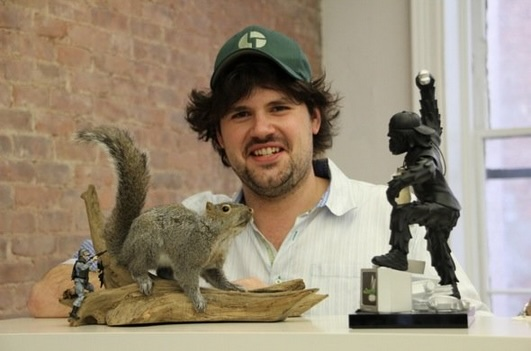

# What is the "Pivotal Squirrel"?
_And how has it wandered away from the Pivotal Offices?_

Once upon a time there was a squirrel. He was a normal, gray, North American tree-rat. He lived a full life - or at least as full as an arboreal rodent can.

And then he died. It doesn't matter how. He died happy. But he was destined for much, much more.

First he was stuffed and mounted on a stick. His post-mortem pose is a bit aggressive, or maybe just pensive, compared to his tranquil life. But he totally owns that piece of wood.

The squirrel passed from living room to garage sale to bachelor mantel until one day he was found by a certain Mr. Keene. Mr. Keene had a son who was very good at computers. Mr. Keene's son, Brandon, deserved a good gift. But the squirrel was not quite awesome enough. It took a far-less-loved mid-90s action figure - providing cover fire from behind the branch - to pull the squirrel across the threshold of awesome. And so Brandon was gifted the squirrel (and "army man").

Brandon realized very quickly that the squirrel was too awesome to be contained in his hipster New York apartment. It needed to be shared with all of his good-at-computers co-workers at Pivotal Labs, New York.

Here our hero became known as "The Pivotal Squirrel" by Pivots, clients, and random visitors alike. He had a coffee table. A home. And he was loved - for some value of love.

Time passed. Seasons changed. And Brandon - and a few others - left Pivotal Labs for a startup called GroupMe. The Pivotal Squirrel was still the Pivotal Squirrel and thus stayed where he rightfully belonged.

But Brandon missed the squirrel. Perhaps the totem enhanced his computer powers. Maybe Brandon's employment was conditional on completing a fraternity-level prank. Or maybe he just wanted to distract Pat Nakajima. No matter. Brandon stole the Pivotal Squirrel.

In the scuffle, the Pivotal Squirrel created a Twitter account. Some Pivots realized the Squirrel was gone, but the world now knew that Brandon was the culprit.

A couple of months later - after much bitching on Twitter - the squirrel blinked and was suddenly in a MongoDB swag bag being smuggled through TSA scanners. This was a noble thing that Parker Thompson did - seizing a golden opportunity to both return the Pivotal Squirrel to Pivotal soil and to actually use MongoDB for productive storage. After a brief detour, the squirrel woke up at Pivotal HQ in San Francisco. One Pivot even put up the single page site isthepivotalsquirrelatgroupme.com (now lapsed) with a big "NO." in a centered `<H1>` tag.

The visit did not last long. Four days later, on a Friday morning Eastern Time, the Pivotal Squirrel was back at GroupME HQ in New York. There have been attempts to re-re-liberate the squirrel, but none successful.

Today Pivots dream of liberating the Pivotal Squirrel once and for all. Until that day, no taxidermied animal can truly be free.

---
_As remembered, and a bit embellished, by Davis W. Frank. As retrieved from a screenshot archive of the Pivotal Discourse server, by Mike Dalessio_